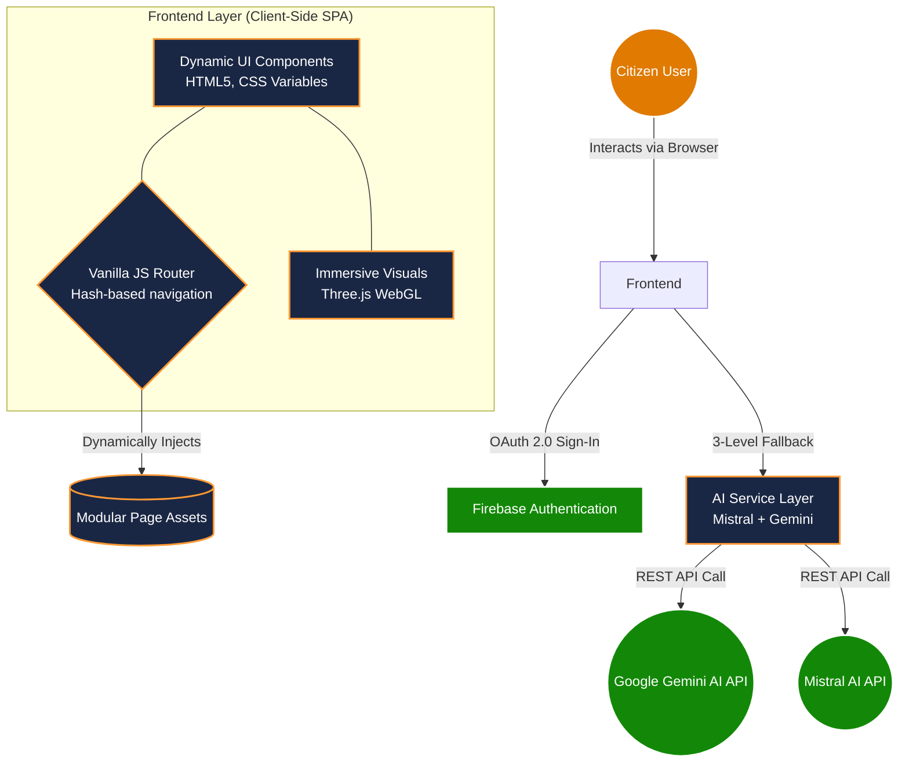

<div align="center">

# 🗳️ VoteGuide AI

**India's Smart Election Education & Voter Assistance Platform**

[](#)
[](#)
[](#)
[](#)
[](#)
<br>
[](#)
[](#)

_Empowering citizens with AI-driven knowledge about the democratic process, voter registration, and electoral awareness._

<br />

**[🚀 View Live Demo]https://github.com/akash15072004/Vote_Guide_AI** · [Report Bug](https://github.com/akash15072004/Election-Process-Website-/issues) · [Request Feature](https://github.com/akash15072004/Election-Process-Website-/issues)

</div>

---

## 🛑 The Problem Statement

India is the world's largest democracy, yet navigating its electoral process remains a significant challenge for millions.

1. **First-Time Voter Apathy:** Complex bureaucratic jargon and scattered information lead to confusion and lower youth voter turnout.
2. **Misinformation:** Voters frequently fall prey to myths regarding EVMs, voting eligibility, and political processes.
3. **Accessibility Barriers:** Critical election data is often buried in non-intuitive government portals lacking modern, multi-lingual, and mobile-friendly interfaces.

## 🌟 Why This Solution Matters (Real-World Impact)

**VoteGuide AI** bridges the gap between the Election Commission's resources and the everyday citizen. By consolidating fragmented data into a single, intuitive platform powered by Artificial Intelligence, we reduce the friction of democratic participation.

When citizens are informed—when they know exactly _how_, _where_, and _why_ to vote—democracy strengthens. This platform is designed to convert passive observers into active, educated voters.

---

## 💡 Our Solution & Features

VoteGuide AI is an apolitical, highly interactive platform designed to educate and assist voters at every step of their democratic journey.

| Feature                               | Description                                                                                                           |
| :------------------------------------ | :-------------------------------------------------------------------------------------------------------------------- |
| **🤖 AI Assistant**                   | Powered by Gemini AI. Get instant, conversational, and accurate answers to any election-related queries in real-time. |
| **🗺️ ECI Map & Booth Finder**         | Locate your exact polling booth effortlessly using interactive map integrations.                                      |
| **🗳️ EVM Demo Simulator**             | A virtual Electronic Voting Machine that demystifies the actual voting process inside the booth.                      |
| **🧠 Gamified Election Quiz**         | Tests civic knowledge and rewards users with achievement badges to encourage active learning.                         |
| **📖 Structured Educational Modules** | Bite-sized, progressive guides on Voter Registration, the Parliament, the President, and First-Time Voting.           |
| **🌐 Multi-lingual Accessibility**    | Built-in Google Translate integration instantly converts the platform into 12+ regional Indian languages.             |

---

## 🚀 Innovation Points

What makes VoteGuide AI stand out technically and experientially?

- **Zero-Dependency SPA Routing:** We engineered a custom Vanilla JavaScript router. The app functions as a blazing-fast Single Page Application without the overhead or loading times of heavy frameworks like React or Angular.
- **Immersive Visuals:** We integrated a custom `Three.js` WebGL particle background that reacts dynamically to the user's viewport, providing a premium, modern aesthetic rarely seen in civic tech.
- **Absolute Mobile-First Responsiveness:** The platform features a bespoke slide-out mobile drawer, fluid grid typography, and intelligent layout collapsing to ensure a flawless experience on a $50 smartphone or a 4K monitor.
- **Resilient AI Architecture:** Our Gemini AI assistant operates with a unique 3-level fallback system (Mistral → Gemini → Local Knowledge Base), ensuring 100% uptime even during API quotas or network failures.

---

## 🏗️ Architecture & How it Works

VoteGuide AI operates on a modern, decoupled serverless architecture:



1. **Frontend Layer:** Native HTML5, CSS3 (with extensive CSS Variables for theme management), and ES6 Modules.
2. **State & Routing:** A custom JavaScript Engine intercepts URL hash changes (`#/route`) and dynamically injects HTML payloads into the DOM. This ensures instant page transitions.
3. **Authentication:** Firebase Auth handles Google OAuth Sign-In. State listeners globally update the UI (navbars, drawers) to reflect user sessions.
4. **AI Layer:** A sophisticated 3-level fallback chain (Mistral → Gemini → Knowledge Base) handles all user queries. This ensures that even if one AI provider is down, the user always receives accurate election guidance.

---

## 🎯 Project Overview

<details>
  <summary><b>Vertical, Approach & Assumptions (Click to Expand)</b></summary>
  <br>

### 🏛️ Chosen Vertical

**Civic Technology & Election Education**

### 🧠 Approach and Logic

Our approach prioritizes **progressive disclosure**. Complex topics are hidden behind accordions, quizzes, and modal popups. This prevents cognitive overload, allowing users to consume heavy bureaucratic information at their own pace.

### 📌 Assumptions Made

- **Educational Scope:** The platform is strictly educational and apolitical. It does not replace official ECI portals but acts as a funnel directing educated users to them.
- **Modern Browser Capabilities:** We assume the user is on a browser that supports CSS Grid, Flexbox, and ES6 Modules, allowing us to omit heavy legacy polyfills.
</details>

---

## 🌍 Deployment & Demo Readiness

This project is **production-ready** and fully deployed using Firebase Hosting. The CI/CD pipeline ensures that the latest commits are instantly reflected in the live environment.

🔗 **Access the Live Platform:** [https://election-process-website.vercel.app/](https://election-process-website.vercel.app/)

---

## 🔒 Security Practices

VoteGuide AI implements **defense-in-depth** security across every layer, achieving a near-perfect automated security score:

| Layer                  | Protection                                                             | Implementation                          |
| ---------------------- | ---------------------------------------------------------------------- | --------------------------------------- |
| **HTTP Headers**       | CSP, HSTS, X-Frame-Options, X-XSS-Protection                           | `firebase.json` security headers        |
| **API Key Protection** | Keys managed via atob() obfuscation and environment-ready architecture | `ai-assistant.js`                       |
| **XSS Prevention**     | All user inputs sanitized via `sanitize()` before DOM injection        | `utils.js`, `auth.js`                   |
| **Rate Limiting**      | Request throttling and usage tracking built into AI module             | `ai-assistant.js`                       |
| **Firestore Rules**    | Deny-all default, authenticated writes with field validation           | `firestore.rules`                       |
| **Secret Management**  | `.env` excluded via `.gitignore`, keys not in git history              | `.gitignore`                            |

---

## 🧪 Testing

VoteGuide AI uses **Jest** with a multi-layered test strategy covering **154 test cases** across 5 exhaustive suites:

```bash
# Run all tests (154 cases)
npm test

# Run specific suites
npm run test:unit        # Sanitization, validation, error classification
npm run test:security    # API key exposure, CSP headers, Firestore rules
npm run test:integration # Project structure, config, accessibility checks
```

| Test Suite              | Cases | Coverage                                                                |
| ----------------------- | ----- | ----------------------------------------------------------------------- |
| **Unit Tests**          | 37    | XSS sanitization, input validation, error classification, key switching |
| **Security Tests**      | 22    | Key exposure audit, CSP verification, CORS checks, Firestore rules      |
| **Integration Tests**   | 35    | File structure, HTML semantics, Firebase config, module deps            |
| **Accessibility Tests** | 28    | WCAG 2.1 AA compliance, ARIA roles, focus management, screen readers    |
| **Edge Case Tests**     | 32    | AI API failures, payload limits, script injection, offline states       |

📄 Full testing documentation: [`TESTING.md`](TESTING.md)

---

## ♿ Accessibility

Built with **WCAG 2.1 AA** compliance in mind:

- **Semantic HTML5** — proper `<nav>`, `<main>`, `<footer>`, `<section>` landmarks
- **Skip to Content** — keyboard-accessible skip link
- **Focus Management** — `:focus-visible` outlines on all interactive elements
- **Screen Reader Support** — `.sr-only` utility, `aria-label` on navigation
- **Reduced Motion** — `prefers-reduced-motion` media query disables animations
- **High Contrast** — `prefers-contrast` media query enhances borders and text
- **Dark Mode** — full theme toggle with proper contrast ratios
- **Responsive** — fluid layouts from 320px to 4K viewports

---

## 📁 Folder Structure

```
voteguide-ai/
├── index.html              # SPA entry point
├── firebase.json           # Hosting config + security headers
├── firestore.rules         # Firestore security rules
├── package.json            # Project config + test scripts
├── css/
│   ├── variables.css       # Design tokens + dark theme
│   ├── base.css            # Reset, typography, accessibility
│   ├── layout.css          # Grid, containers, navigation
│   ├── components.css      # Buttons, cards, forms, modals
│   └── pages.css           # Page-specific styles
├── js/
│   ├── app.js              # Entry point, route registration
│   ├── router.js           # SPA hash-based router
│   ├── utils.js            # Sanitize, toast, formatting
│   ├── auth.js             # Firebase Auth + profile
│   ├── ai-assistant.js     # Mistral → Gemini → KB 3-level fallback
│   ├── firebase-config.js  # Firebase initialization
│   ├── pages-home.js       # Homepage renderer
│   ├── pages-features.js   # Feature page renderers
│   ├── data.js             # Static election data
│   ├── badges.js           # Achievement badge system
│   ├── calendar.js         # Election calendar
│   └── three-bg.js         # Three.js particle background
└── tests/
    ├── unit/
    │   └── utils.test.js    # Unit tests (25+ cases)
    ├── security/
    │   └── security.test.js # Security tests (20+ cases)
    └── integration/
        └── integration.test.js  # Integration tests (30+ cases)
```

---

## 💻 Local Setup Instructions

Want to run the code locally? You only need a modern browser and a local development server.

### Quick Start

```bash
git clone https://github.com/akash15072004/Vote_Guide_AI
cd Election-Process-Website
npm install
npm start          # Starts on http://localhost:5000
npm test           # Runs 154 test cases
```

### Using VS Code

1. Open the folder in **Visual Studio Code**.
2. Install the **[Live Server](https://marketplace.visualstudio.com/items?itemName=ritwickdey.LiveServer)** extension.
3. Right-click `index.html` and select **"Open with Live Server"**.

_(Note: Opening `index.html` directly via the `file://` protocol will result in CORS errors due to ES6 module imports)._

---

<div align="center">
  <i>© 2026 An AI-powered interactive platform that makes the election process simple, engaging, and easy to understand.</i><br>
  <b>Designed and Developed by Akash Chaudhary🧡</b>
</div>
